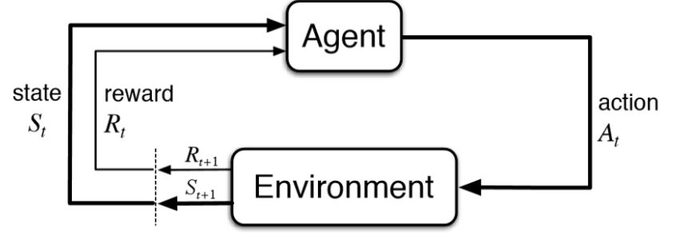
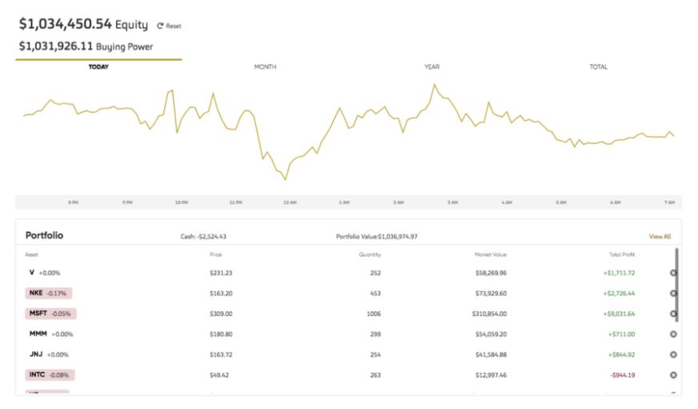

# Algorithmic-paper-trading-using-Deep-Reinforcement-Learning

This is an application for paper Trading, to test the strategies of investing in real market and observe its performance , before investing the real money.

## What Is Paper Trade?
A paper trade is a simulated trade that allows an investor to practice buying and selling without risking real money. The term dates back to a time when (before the proliferation of online trading platforms) aspiring traders would practice on paper before risking money in live markets. While learning, a paper trader records all trades by hand to keep track of hypothetical trading positions, portfolios, and profits or losses. Today, most practice trading involves the use of an electronic stock market simulator, which looks and feels like an actual trading platform.

* Paper trading is simulated trading that allows investors to practice buying and selling securities.
* Paper trading can test a new investment strategy before employing it in a live account.
* Many online brokers offer clients paper trade accounts.
* Paper trades teach novices how to navigate platforms and make trades, but may not represent the true emotions that occur during real market conditions.

This is a Tutorial from start to finish in a single Jupyter Notebook: collect data, do data engineering, train and deploy the DRL agent, execute trades, and monitor portfolio performance

## Why its useful?

Stock trading is an important part of investment, and it is difficult to create an automated agent that can trade effectively in the volatile stock market. 

Because a profitable AI agent is appealing to practically everyone, stock trading is one of the trendiest subjects in machine learning. To use an intelligent trading agent to manage a stock account automatically, all you have to do is open a portfolio, lie on the couch, and count your money. 

In the world of trading, Deep Reinforcement Learning (DRL) has proven its worth. The purpose of this project is to demonstrate that a PPO(Proximal Policy Gradient) agent trained in stock market data can profit from backtesting.

> Problem formulation

Let's pretend we were given a million dollars at the start of 2021. We'd like to put $1,000,000 into stock markets, namely the Dow Jones 30 members. 

Mr.X, a savvy portfolio manager, has been hired. Mr. X will provide us with daily recommendations, such as portfolio weights or percentages of money to invest in these 30 stocks. So all we have to do every day is rebalance the stock portfolio weights.

> Solution

**Reinforcement learning** 

* Reinforcement learning is a branch of machine learning dedicated to training agents to operate in an environment, in order to maximize their utility in the pursuit of some goals.

* Its underlying idea, is that intelligence is an emergent property of the interaction between an agent and its environment. This property guides the agent’s actions by orienting its choices in the conduct of some tasks.

* The system is described as an agent that interacts with the environment through actions at discrete time steps and is rewarded. This causes the agent to enter a new state. The figure below depicts a classic agent-environment feedback loop.

As in RL , we have action critic roles, we make startegies to take actions in order to maximise our profits. Here actions are sell, hold or buy the shares , and rewards are the profit or loss obtained by respective action.

We use **Proximal policy Gradient** to obtain best strategy in order to reach our goal. The theory and mathematical intuition behin the PPO is explained in the .ipynb file. Please first understand the theory of PPO before directly diving into code implementation.

### Implementation
For implementing the PPO algorithm we have used the [FinRL](http://finrl.org/) library. 
Refer documentation for [FinRL_documentation](https://finrl.readthedocs.io/en/latest/index.html). 
### Deployment
The resulting strategy was deployed using the ALPACA finance API to track portfolio performance . 
Alpaca Stock Trading API is built for algorithmic trading and building apps for commission-free.

Documentation : [Alpaca docs](https://alpaca.markets/docs/)

We are using alpaca because its easy to use, has good interface for algo-trading, beginner friendly and can access unlimited testing of the strategies .

Register in alpaca from [here](https://alpaca.markets) and get your API Key ID & Secret ID.

### Final Results

Our program invested automatically through ALPACA API, and got the portfolio given below.

## References

https://towardsdatascience.com/policy-gradients-in-a-nutshell-8b72f9743c5d

PPO paper: https://arxiv.org/abs/1707.06347

TRPO paper: https://arxiv.org/abs/1502.05477

Base implementation of PPO : https://github.com/higgsfield/RL-Adventure-2/blob/master/3.ppo.ipynb
